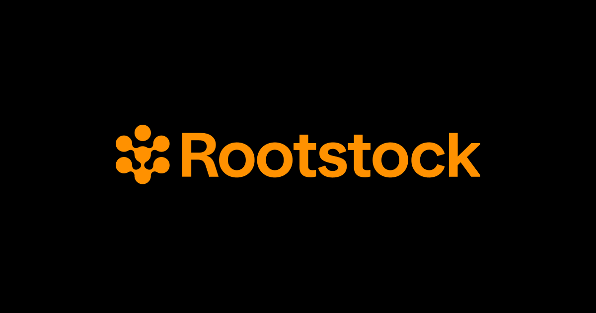

# Rootstock Foundry Starter Kit

## Rootstock Foundry Starter Kit Configuration

This starter kit provides a ready-to-use setup for developing, testing, and deploying smart contracts on the [Rootstock](https://rootstock.io/) network using [Foundry](https://book.getfoundry.sh/). It includes essential tools and configurations to streamline your workflow, ensuring best practices and efficient development.

- Testing environment configured and operational, with test coverage
- [Prettier](https://prettier.io/) and [solhint](https://github.com/protofire/solhint) configured for project files and [Solidity](https://soliditylang.org/) smart contract
- Prepared Smart Contract Examples, Tests, Deployments, and Tasks for sample contracts (ERC20 and Counter)
- Sample deploy guide to deploy smart contracts on Rootstock Network

## Project Structure

```
.
├── Makefile
├── foundry.toml
├── package.json
├── remappings.txt
├── script
│   ├── Counter.s.sol
│   └── MockERC20.s.sol
├── src
│   ├── Counter.sol
│   └── MockERC20.sol
├── test
│   ├── Counter.t.sol
│   └── MockERC20.t.sol
└── yarn.lock
├── lib/
├── out/

```

### Main Folders

- **src:** This folder contains the main smart contracts of the project. Here you will define the core logic of your application.
- **script:** This folder contains the deployment scripts for the smart contracts. These scripts are used to deploy your contracts to the blockchain.
- **test:** This folder contains the test files for your smart contracts. It is used to write and run tests to ensure that your contracts behave as expected.

## Supported Networks

- Foundry Test Network
- Rootstock Mainnet
- Rootstock Testnet

## Foundry Commands

These are the most common commands and how you can call the in this project

Based on the package.json scripts:

- `npm run setup` - to clean and build the project
- `npm run sync` - to update the project
- `npm run test` - to run tests
- `npm run snapshot` - to create a snapshot
- `npm run format` - to format the code
- `npm run lint` - to lint the code
- `npm run all` - to run all the above tasks

Additional Foundry-specific commands:

- `forge build` - to compile smart contracts
- `forge script` - to run scripts
- `forge fmt` - to format code
- `forge help` - to see all available commands

## Use the project

### Setup

1. Install Foundry CLI

```bash
curl -L https://foundry.paradigm.xyz | bash
```

> [!NOTE]
> If you’re on Windows, you will need to install and use [Git BASH](https://gitforwindows.org/) or [WSL](https://learn.microsoft.com/en-us/windows/wsl/install).

2. Clone the project

```bash
git clone https://github.com/chrisarevalo11/rsk-foundry-starter-kit.git
```

3. Install Dependencies

```bash
cd rsk-foundry-starter-kit
npm install
```

4. Compile Contracts

```bash
forge build # or npm run setup
```

### Environment Setup

To set up your environment, follow these steps:

1. Create a `.env` file and add your environment variables. You can use `.env.example` as a template. Ensure you include the following variables:

```env
RSK_RPC_URL=''
PRIVATE_KEY=''
```

> [!NOTE]
> The private key can be found in your [Metamask wallet](https://support.metamask.io/es/managing-my-wallet/secret-recovery-phrase-and-private-keys/how-to-export-an-accounts-private-key/).

2. Get your RPC url. The RPC url can be for mainnet or testnet, depending on where you want to deploy. To get your private RPC url go to the [Rootstock RPC API docs](https://rpc.rootstock.io/).

3. Indicate that your usnig `.env` file.

```bash
source .env
```

## Example flow

This is an example flow to deploy an ERC20 token to a public network and interact with it.

1. Test your contract:

```bash
npm run test
```

2. Deploy your contract by running its deployment script:

```bash
forge script script/MockERC20.s.sol:MockERC20 --broadcast --legacy --rpc-url $RSK_TESTNET_RPC_URL
```

> [!NOTE]
> You can remove the `--broadcast` flag if you wan to simulate the transaction locally. Also, the `--legacy` flag is required for supporting EIP-1159.

> [!TIP]
> If you get an error like `Transaction dropped from the mempool: <tx-id>` check the tx-id in the explorer. The tx may have went successful but the error is still in the logs. Here are the [mainnet](https://explorer.rootstock.io/) and [testnet](https://explorer.testnet.rootstock.io/) explorers.

## Final Comments

Explore and be curious about the folders and files of this starter kit. You'll learn how to import `.env` variables for deploying smart contracts, test smart contracts with solidity. Feel free to customize this starter kit to suit your project’s needs. Happy coding!
